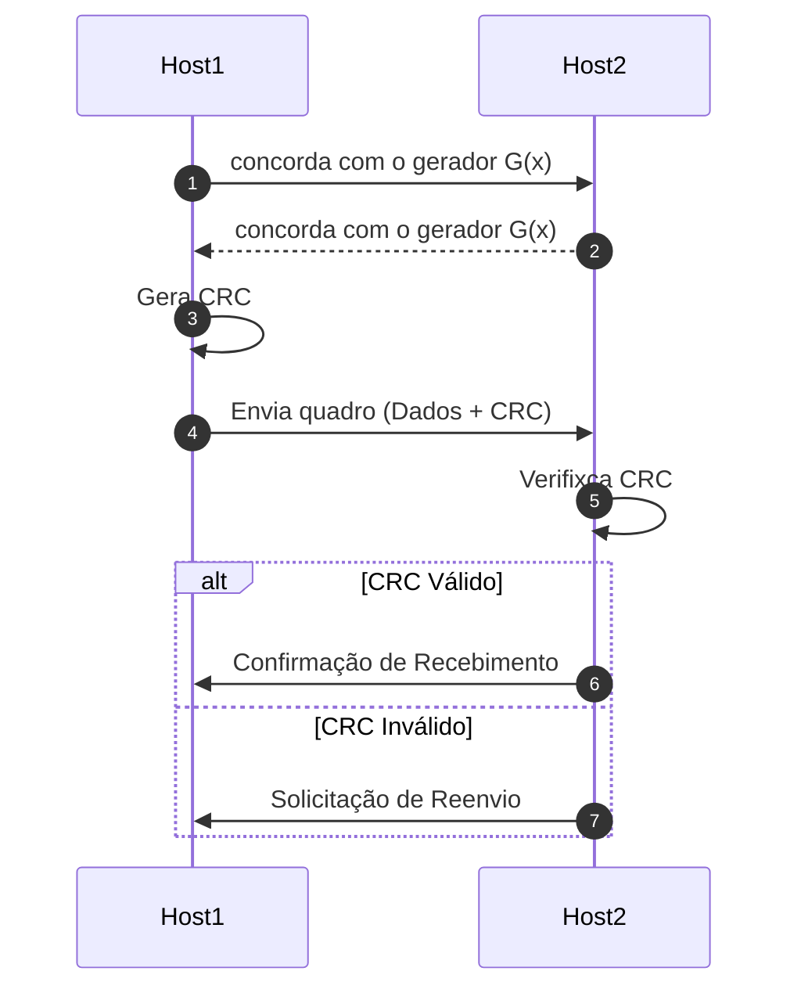

# **Laboratório de Redes de Computadores: Implementação e Análise do CRC**

Neste laboratório, vamos entender um dos metodos mais utilizados para verificar a integridade de dados na camada de enlace. Como demonstrado no laboratório de modulação, o ruído na comunicação, pode ser um problema, nesse laboratório nosso foco será *Cyclic Redundancy Check* (CRC), um dos algoritmos de detecção de erros mais robustos e prevalentes em redes de computadores.


No primeiro momento vocês irão traduzir a teoria matemática do CRC, baseada em aritmética polinomial, em uma implementação funcional em Python, sem o auxílio de bibliotecas especializadas. Em seguida, conduzirão uma análise empírica, comparando o desempenho da sua implementação manual com uma solução de biblioteca otimizada, e investigarão os limites práticos de detecção de erros do algoritmo.

1. [Etapa 1](#parte-1-a-fundamentação-matemática-do-crc) : Fundamentos
1. [Etapa 2](#parte-2-implementação-manual-do-algoritmo-crc) : Implementação do algoritmo
    - 📨 **Entrega** : O algoritmo
1. [Etapa 3](#parte-3-análise-comparativa-de-desempenho) : Comparativo de desempenho
    - 📨 **Entrega** : Relatorio/Descrição com graficos
1. [Etapa 4](#parte-4-análise-investigativa-da-detecção-de-erros-cenário-personalizado) : Investigação dos erros
    - 📨 **Entrega 4.1** : Planilha prenchida
    - 📨 **Entrega 4.2** : Report do ponto cego

>📍**Todos os pontos devem ser entregues como notebook jupyter** com link do repositorio e um pdf (basta imprimir) no google classroom.

## Parte 1: A Fundamentação Matemática do CRC

Antes de construir o nosso CRC, é importante compreender a lógica matemática que sustenta o CRC. O algoritmo trata sequências de bits como representações de polinômios com coeficientes binários (0 ou 1).

Seja, uma **mensagem** com $m$ bits, representada pelo **polinômio** $M(x)$, e um **polinômio gerador pré-acordado** de grau $r$, representado por $G(x)$. Ou seja, $G(x)$ tem $r$ bits e $M(x)$ tem $m$ bits.


O diagrama ilustra o processo de troca de mensagens entre dois hosts durante uma transmissão com verificação por CRC: 

- [Passo 1 e 2] Host1 e Host2 acordam sobre o gerador polinomial G(x) que será usado; 
- [Passo 3 e 4] Host1 calcula o CRC com base nos dados e no gerador acordado, e envia o quadro (dados + CRC) ao Host2; 
- [Passo 5 a 7] O Receptor verifica a integridade do quadro recebido aplicando o mesmo gerador. 
    - caso o CRC seja considerado válido, Host2 envia uma confirmação de recebimento; 
    - caso contrário, solicita o reenvio dos dados. 
    


Essa sequência representa negociação, geração, transmissão e verificação do CRC num contexto de comunicação entre dispositivos. Os passos a seguir explicam com um pouco mais de detalhe o alguns passos importantes.

**1. Geração do CRC:**

O transmissor realiza os seguintes passos:

> a. Anexa $r$ bits '0' ao final da mensagem. 
> - Matematicamente, isso equivale a multiplicar o polinômio da mensagem por $2^r$, resultando em $M(x) \cdot 2^r$. Esse deslocamento "abre espaço" para o código CRC.
>
> b. Divide $M(x) \cdot 2^r$ pelo polinômio gerador $G(x)$. 
> - A divisão aqui é uma divisão binária sem transporte, implementada através de operações **XOR**.
>
> c. O **resto** dessa divisão, uma sequência de $r$ bits, é o CRC.

A fórmula para o cálculo do CRC é, portanto:

$$CRC = (M(x) \cdot 2^r) \pmod{G(x)}$$

O quadro a ser transmitido, $T(x)$, é a mensagem original com o CRC anexado:

$$T(x) = M(x) \cdot 2^r + CRC$$

Em resumo, o quadro transmitido T(x) e a messagem horiginal + crc  (|T(x)| = m + r bits)
```
T(x) = |   messagem   |   crc   |
            m bits   +   r bits
```

**2. Verificação do CRC:**

O receptor recebe o quadro $T(x)$ (Passo 5 a 7) e o divide pelo mesmo polinômio gerador $G(x)$, já combinado no Passo 1. Pela propriedade da aritmética modular, se não houveram erros na transmissão, o resto desta divisão será zero.

$$\bmod \frac{T(x) }{G(x)} = 0 \quad \implies \quad \text{Mensagem Íntegra}$$
<!-- $$\frac{T(x)}{\pmod{G(x)}} = 0 \quad \implies \quad \text{Mensagem Íntegra}$$ -->

Qualquer resto diferente de zero indica que um erro foi detectado no quadro recebido.

## Parte 2: Implementação Manual do Algoritmo CRC

Nesta etapa, vocês irão implementar as equações acima. O desafio consiste em simular a divisão polinomial utilizando operações bit a bit.

**Instruções:**

1.  **Implemente a Função Principal:** Crie a função `calcular_crc_manual` conforme o esqueleto abaixo. Ela deve receber a mensagem e o gerador (como strings de bits) e retornar o CRC (o resto da divisão).

2.  **Implemente a Lógica de Divisão (XOR):** A operação `mod` na equação é realizada através de repetidas operações de XOR. Fornecemos uma função auxiliar `xor_bits` para sua conveniência. O seu trabalho é orquestrar o processo de divisão.

```python
def xor_bits(a, b):
    """
    Realiza a operação de XOR bit a bit entre duas strings binárias de mesmo comprimento.
    """
    resultado = ""
    for i in range(len(a)):
        if a[i] == b[i]:
            resultado += '0'
        else:
            resultado += '1'
    return resultado


def calcular_crc_manual(dados_bits: str, gerador_bits: str) -> str:
    """
    Calcula o CRC para uma sequência de dados M(x) usando um gerador G(x).
    
    Args:
        dados_bits: A string binária representando o polinômio da mensagem, M(x).
        gerador_bits: A string binária representando o polinômio gerador, G(x).
        
    Returns:
        A string binária de r bits representando o CRC.
    """
    # 1. Obtenha o grau 'r' do gerador.
    #    Lembre-se que um gerador de n bits representa um polinômio de grau n-1.
    r = len(gerador_bits) - 1
    
    # 2. Crie M(x) * 2^r, que é a mensagem com 'r' zeros anexados.
    mensagem_aumentada = list(dados_bits + '0' * r)
    
    # 3. Implemente o loop de divisão.
    #    Percorra a mensagem bit a bit.
    for i in range(len(dados_bits)):
        # Se o bit mais significativo da 'janela' atual for '1', realize o XOR.
        # - a janela 
        if mensagem_aumentada[i] == '1':
            janela_atual = "".join(mensagem_aumentada[i : i + r + 1])
            resultado_xor = xor_bits(janela_atual, gerador_bits)
            
            # Atualize a mensagem com o resultado do XOR.
            for j in range(len(resultado_xor)):
                mensagem_aumentada[i + j + 1] = resultado_xor[j]
    
    # 4. O resto da divisão são os 'r' bits finais da mensagem processada.
    resto = "".join(mensagem_aumentada[-r:])
    return resto

def calcular_crc_manual(dados_bits: str, gerador_bits: str) -> str:
    """
    Calcula o CRC para uma sequência de dados M(x) usando um gerador G(x).
    
    Args:
        dados_bits: A string binária representando o polinômio da mensagem, M(x).
        gerador_bits: A string binária representando o polinômio gerador, G(x).
        
    Returns:
        A string binária de r bits representando o CRC.
    """
    # 1. Obtenha o grau 'r' do gerador.
    #    Lembre-se que um gerador de n bits representa um polinômio de grau n-1.
    r = -1

    # 2. Crie T(x)=  M(x) * 2^r, que é a mensagem com 'r' zeros anexados.
    mensagem_aumentada = list(dados_bits + '0' * r)

    # 3. Implemente o loop de divisão.
    #    Percorra os bit original da mensagem (em uma janela), da esquerda para a direita.
    for i in range(len(dados_bits)):
        # Se o bit mais significativo da 'janela' atual for '1', realize o XOR.
        # - considere a janela atual como os próximos r+1 bits. (para pode dividir o por G(x))
        if mensagem_aumentada[i] == '1':
            janela_atual = "".join(mensagem_aumentada[inicio : fim]) # inicio e fim devem calculados
            resultado_xor = xor_bits(janela_atual, gerador_bits)

            # Atualize a mensagem com o resultado do XOR.
            # - Substitua os bits correspondentes na mensagem pela saída do XOR,
#          ignorando o primeiro bit (que já foi processado).
            for j in range(len(resultado_xor)):
                mensagem_aumentada[i + j + 1] = resultado_xor[j]

    # 4. O resto da divisão são os 'r' bits finais da mensagem processada.
    resto = "".join(mensagem_aumentada[-r:])
    return resto
```

Para testar o metodo execute o codigo é compare o resultado com slide 48 da `RCNA_05`.

```python
# Exemplo de uso para validação
dados_teste = "1101011111"  # M(x)
gerador_teste = "10011"    # G(x)
crc_calculado = calcular_crc_manual(dados_teste, gerador_teste)

print(f"Dados M(x): {dados_teste}")
print(f"Gerador G(x): {gerador_teste}")
print(f"CRC Calculado: {crc_calculado}")
# Quadro T(x) a ser transmitido: dados_teste + crc_calculado
```

>‼️**Importante**‼️ : Entende as operações realizadas com base nos livros e e complete o codigo coompremdendo o conceito.

## Parte 3: Análise Comparativa de Desempenho

Agora que possuem uma implementação funcional, vamos analisá-la sob uma perspectiva da efiência. Como o seu algoritmo se compara em eficiência a uma biblioteca padrão, que geralmente é implementada em uma linguagem de mais baixo nível (como C) para otimização?

**Instruções:**

1.  **Instale a Biblioteca de Referência:** `pip install crc`

2.  **Crie um Script de Teste:** Este script deverá medir o **tempo de execução** e o **pico de alocação de memória** para calcular o CRC de mensagens de tamanhos variados, utilizando tanto a sua função `calcular_crc_manual` quanto a função da biblioteca `crc`.

3.  **Defina os Tamanhos de Mensagem:** Teste para, no mínimo, os seguintes tamanhos de payload:

      * **1500 bytes:** Tamanho padrão de um quadro Ethernet (MTU).
      * **4500 bytes:** Um tamanho intermediário de Jumbo Frame.
      * **9000 bytes:** Um tamanho comum para Jumbo Frames.
      * Gere dados aleatórios para cada um desses tamanhos.

4.  **Realize as Medições:** Utilize os módulos `time` e `tracemalloc` do Python para coletar os dados de desempenho.


```python
import time
import tracemalloc
import os
from crc import Calculator, Crc16

# --- Insira sua função calcular_crc_manual e xor_bits aqui ---

 # Usando um padrão de 16 bits como referência
calculator_lib = Calculator(Crc16.MODBUS)

# Tamanhos de mensagem para teste (em bytes)
tamanhos_bytes = [1500, 3000 , 6000 , 16000]

resultados = []

for tamanho in tamanhos_bytes:
    print(f"Analisando para mensagem de {tamanho} bytes...")
    # Gere uma mensagem aleatória de bits
    mensagem_bytes = os.urandom(tamanho)
    mensagem_bits = "".join(format(byte, '08b') for byte in mensagem_bytes)
    
    # Medição da nossa Implementação
    tracemalloc.start()
    start_time = time.perf_counter()
    
    crc_manual = calcular_crc_manual(mensagem_bits, "11000000000000101") # G(x) do CRC-16/MODBUS
    
    end_time = time.perf_counter()
    mem_atual_manual, mem_pico_manual = tracemalloc.get_traced_memory()
    tracemalloc.stop()
    
    tempo_manual = end_time - start_time
    
    # Medição da Biblioteca
    tracemalloc.start()
    start_time = time.perf_counter()
    
    crc_lib = calculator_lib.checksum(mensagem_bytes)
    
    end_time = time.perf_counter()
    mem_atual_lib, mem_pico_lib = tracemalloc.get_traced_memory()
    tracemalloc.stop()
    
    tempo_lib = end_time - start_time
    
    # Armazene os resultados
    resultados.append({
        "tamanho": tamanho,
        "tempo_manual": tempo_manual,
        "mem_pico_manual": mem_pico_manual / 1024, # em KiB
        "tempo_lib": tempo_lib,
        "mem_pico_lib": mem_pico_lib / 1024 # em KiB
    })

print("--- Resultados Finais ---")
print(resultados)
```

Ao final utilizando o `matplotlib` gerem dois graficos, ambos os gráficos devem conter as duas curvas (Manual vs. Biblioteca): 

- Gráfico 1: Tamanho da Mensagem (x) vs. Tempo de Execução (y)
- Gráfico 2: Tamanho da Mensagem (x) vs. Pico de Memória (y)

> ⚠️ **Descreva a máquina que executou o código** (informar a processador - i.e., i9, arm , i3 ,...) e comente os resultados comparando as duas abordagens e os resultados.

## Parte 4: Análise Investigativa da Detecção de Erros (Cenário Personalizado)

Esta etapa final é uma investigação para encontrar os limites da sua implementação, utilizando um cenário único para cada aluno.


### 4.1 - Preparação do seu cenário

> a.  **Sua Mensagem Pessoal:** utilize seu **seu nome completo** e o converta para uma string de bits usando codificação ASCII (8 bits por caractere). Essa será sua `MENSAGEM_BASE`.
>   - Você pode utilizar o site [convertbinary.com](https://pt.convertbinary.com/texto-para-binario/)
>   - Ex: `nome = "Ana"` -\> `bits = "010000010110111001100001"`
>
> b. **Escolha o seu Gerador pessoal:**  utilize **um** dos seguintes polinômios geradores de CRC-16 padrão, com base no **último dígito do seu número de matrícula**:
>   - **Final 0, 1, 2:** CRC-16/MODBUS (`11000000000000101` ou $x^{16} + x^{15} + x^2 + 1$) -\> `11000000000000101`
>   - **Final 3, 4, 5:** CRC-16/ARC (`10001000000100001` ou $x^{16} + x^{12} + x^5 + 1$) -\> `1100000100010001` (representação de 17 bits) (UTILIZEM O MODBUS)
>   - **Final 6, 7:** CRC-16/MAXIM (`10011000000010001` ou $x^{16} + x^{15} + x^{14} + x^{11} + x^4 + x^2 + x^0$)
>   - **Final 8, 9:** CRC-16/CCITT-FALSE (`10001000000100001` ou $x^{16} + x^{12} + x^5 + 1$) -\> `10001000000100001`


> ⚠️ **Prencha a planilha**

| VARIAVEL              | VALOR |
| :-                    | :-    |
| `MENSAGEM`            |   ?   |
| `MENSAGEM_BASE`       |   ?   |
| `CRC`                 |   ?   |

### 4.2 - A Caça aos Erros

Agora é hora de colocar sua função `calcular_crc_manual` à prova — e comparar a acuracia da sua implementação com a biblioteca!

Para isso, use sua `MENSAGEM_BASE` fixa e siga o procedimento abaixo **dez vezes**, variando a posição e o tipo dos erros inseridos de forma aleatória em cada experimento. Seu objetivo é descobrir quais padrões de erro **passam despercebidos** pelo seu CRC.

#### Procedimento de Teste (a ser repetido 10 vezes)

1. Calcule o CRC da sua `MENSAGEM_BASE`.
2. Forme o `QUADRO_TRANSMITIDO` (T(x)): concatene a mensagem com o CRC calculado.
3. Escolha uma **posição aleatória** e insira um **erro de rajada de $n$ bits** (e.g., uma sequência contínua de $n$ bits invertidos).
4. Obtenha o `QUADRO_CORROMPIDO`, aplicando XOR entre o `QUADRO_TRANSMITIDO` e o padrão de erro.
5. Calcule o CRC do `QUADRO_CORROMPIDO`, usando:
   * Sua função `calcular_crc_manual`.
   * A função da **biblioteca de CRC**.
6. Verifique se o erro foi detectado:
   * Se o CRC resultante for uma sequência de zeros, o erro **não foi detectado**.
   * Se o CRC resultante for diferente de zero, o erro **foi detectado**.
7. **Registre o padrão de erro e a posição onde ele foi inserido**, especialmente se não for detectado por uma das implementações.


#### ⚠️ Reportando o Ponto Cego

Como aprendemos, o CRC-16 tem suas limitações. Em teoria, ele **detecta todas as rajadas**, mas para erros maiores que sua capacidade, **nem todos os casos são garantidos**.

Sua missão é encontrar pelo menos um **padrão de erro de $n$ bits** que **não seja detectado**. Você deve:

* Reportar **em qual dos 10 testes isso ocorreu**.
* Identificar **qual implementação falhou** (manual, biblioteca ou ambas).
* Analisar **em qual posição e qual padrão** foi usado.

Ao final dos testes, compare os resultados entre sua implementação manual e a da biblioteca. Há diferenças? Um dos métodos detectou erros que o outro deixou passar?

<!-- **Dica Técnica:**

Use um gerador aleatório para criar as posições de inserção do erro e os padrões de 17 bits. Você pode inverter todos os bits do trecho escolhido, ou criar variações no padrão (por exemplo, `10000000000000001`, `11111110000000000`, etc.). -->


⚠️ **Resultado Esperado:**

Você deve entregar um pequeno relatório com:

1. Os 10 padrões de erro testados e suas posições.
1. Indicação de quais erros **foram ou não detectados**.
1. Qual implementação falhou em cada caso.
1. Reflexão sobre as limitações do CRC, testado e a comparação.

E o disponibilizar o link para o repositorio.

Boa sorte!

